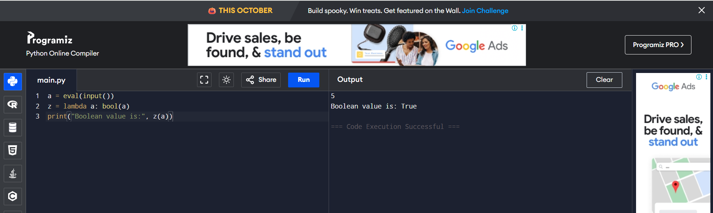

# EX-06 - Amstrong number(iterative statement)
## AIM:
To write a Python program that computes whether a given integer is an Armstrong Number or not. (An Armstrong number is one where the sum of its digits, each raised to the power of the number of digits, equals the original number.)

## ALGORITHM:

1. START the program.

2. Read the integer input from the user and store it in n.

3. Initialize a variable rev (for the calculated sum) to 0.

4. Calculate the number of digits (length) by converting n to a string and using len().

5. Store the original number in temp (for comparison later).

6. Start a while loop that continues as long as n is not equal to 0.

7. Inside the loop: a. Extract the last digit (d) of n using the modulus operator: d=n%10. b. Add the digit raised to the power of the length to rev: rev=rev+d∗∗length. c. Remove the last digit from n using integer division: n=n//10.

8. After the loop, compare the final calculated sum (rev) with the original number (temp).

9. Use an if statement to print whether the number temp is or is not an Armstrong number.

10. STOP the program.

## PROGRAM:
```
n = int(input())
rev = 0
length = len(str(n))
temp = n
while n != 0:
    d = n % 10
    rev = rev + d ** length
    n //= 10

if temp == rev:
    print(f"The given number {temp} is an Armstrong number.")
else:
    print(f"The given number {temp} is not an Armstrong number.")
```

## OUTPUT:


## RESULT:
The program correctly calculates the sum of the digits raised to the power of the number of digits and compares it with the original number to determine if it is an Armstrong number.
 
 


# EX-07-Function

## AIM:

To write a Python program that takes any object (value) as input and returns its Boolean value (True or False) using the inbuilt bool() function.

## ALGORITHM:

1. START the program.

2. Read the input value (which could be of any type) from the user using eval(input()) and store it in a.

3. Define a lambda function z that takes one argument and returns its Boolean equivalent using the bool() function.

4. Call the lambda function z with the input value a and print the result, prefixed with the label "Boolean value is:".

5. STOP the program.


## PROGRAM:
```
a = eval(input())
z = lambda a: bool(a)
print("Boolean value is:", z(a))
```

## OUTPUT:




## RESULT:

The program successfully uses the bool() function to evaluate the truthiness of the input object and prints the corresponding Boolean value.
 
 


# EX-08-patterns

## AIM:
To write a Python program that takes an integer input N and prints a pattern of decreasing even numbers for N rows.


## ALGORITHM:
1. START the program.

2. Read the integer input N from the user.

3. Use an outer for loop that iterates i from 0 up to N−1 (to control the number of rows).

4. Inside the outer loop, use an inner for loop that iterates j from 0 up to i (to control the number of elements in each row).

5. Inside the inner loop: a. Calculate the even number to be printed using the formula: 2×N−(j×2). b. Print the calculated number followed by a space, using end="" to keep the numbers on the same line.

6. After the inner loop finishes (end of the row), use a standalone print() statement to move the cursor to the next line.

7. STOP the program.

## PROGRAM:
```
n = int(input())
for i in range(n):
    for j in range(i + 1):
        print(2 * n - (j * 2), end=" ")
    print()
```

## OUTPUT:


## RESULT:

The program successfully uses nested loops to generate the required pattern of decreasing even numbers for the specified number of rows.
 
 


# EX-09-Use while loop (reverse)

## AIM:
To write a Python program that reverses the digits of a given integer.


## ALGORITHM:
1. START the program.

2. Read the integer input and store it in n.

3. Initialize a variable rev (for the reversed number) to 0.

4. Start a for loop that iterates based on the number of digits in n (the code uses a fixed loop for 4 digits, but the logic inside performs the actual reversal using n's value). Note: The loop structure in the provided code is unusual but the logic relies on the standard while loop steps.

5. Inside the loop (or equivalent while loop): a. Extract the last digit (d) of n using the modulus operator: d=n%10. b. Update the reversed number: rev=rev×10+d. c. Remove the last digit from n using integer division: n=n//10.

6. Print the final reversed number (rev), prefixed with the label "Reverse of the number:".

7. STOP the program.


## PROGRAM:
```
n = int(input())
rev = 0
while n > 0:
    d = n % 10
    rev = rev * 10 + d
    n //= 10
    
print("Reverse of the number:", rev)
```

## OUTPUT:


## RESULT:
The program correctly reverses the order of the digits of the input number by repeatedly extracting the last digit and constructing the new number.


# EX – 10 using Function
## AIM:
To write a Python program that defines a function named result which accepts three values (a,b,c) and returns their multiplication.

## ALGORITHM:
1. START the program.

2. Define a function named result that takes three parameters (a,b,c).

3. Inside the function, calculate the product of the three parameters: mul=a×b×c.

4. Print the result, prefixed with "Multiply is", from inside the function. (Note: A typical function returns the value; this function prints it as shown in the code.)

5. Read the three integer inputs from the user and store them in a,b,c (overwriting the function parameters, which is poor practice but what the code shows).

6. Call the function result(a,b,c) with the user-provided inputs.

7. STOP the program.


## PROGRAM:
```
def result(a, b, c):
    mul = a * b * c
    print("Multiply is", mul)
a = int(input())
b = int(input())
c = int(input())

result(a,b,c)
```
## OUTPUT:


## RESULT:
 The program successfully defines and calls a function, passing the three input values to it, and calculating and printing their product.
